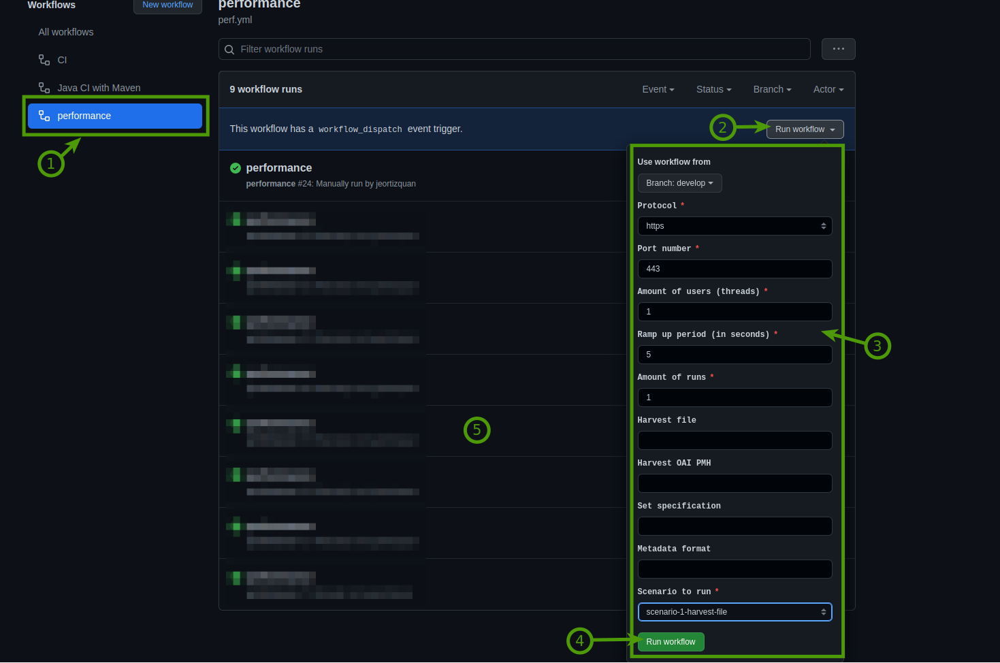

# Metis Sandbox

## Purpose
Give a client (GLAM or aggregator) an environment to test their dataset before sending it to Europeana

## Docker installation for testcontainers

The project uses testcontainers for integration tests.   
For that reason docker has to be part of the system where the integration tests are run and the files should have the correct permissions.  
If docker is not present the integration tests could be skipped, check below.  
Configuring docker:

Example installing docker:
> sudo apt-get update  
> sudo apt install apt-transport-https ca-certificates curl software-properties-common  
> curl -fsSL https://download.docker.com/linux/ubuntu/gpg | sudo apt-key add -  
> sudo add-apt-repository "deb [arch=amd64] https://download.docker.com/linux/ubuntu focal stable"   
> sudo apt install docker-ce

Check docker installation:
> sudo systemctl status docker

Check user of intellij(or any other application that runs the tests)
> ps aux | grep intellij

Add user that runs intellij to the docker group(replace _<user>_ accordingly)
> sudo usermod -aG docker <user>  

If there is an error when running in intellij, the permissions of the socket file might be the problem. Update them:
> sudo chmod a+rw /var/run/docker.sock   

## Run/Build Application(Runs both unit and integration tests)

> mvn clean verify

## Skip integration tests

> mvn clean verify -DskipITs

## Skip unit tests and integration tests

> mvn clean verify -DskipTests -DskipITs

## Only run integration tests(compile all tests, skip unit tests)

> mvn clean test-compile failsafe:integration-test

That will generate a WAR file that you can deploy to a tomcat instance

## Docker/Docker Compose  
With docker-compose we can easily deploy relevant containers locally.
The file docker-compose.yml can be used for local deployment of relevant containers.
Installing latest docker-compose:

> curl -s https://api.github.com/repos/docker/compose/releases/latest | grep browser_download_url  | grep docker-compose-linux-x86_64 | cut -d '"' -f 4 | wget -qi -  
> chmod +x docker-compose-linux-x86_64  
> sudo mv docker-compose-linux-x86_64 /usr/bin/docker-compose  

## API
Composed by 2 endpoints

`POST metis-sandbox/dataset/{name}/process`

This endpoint let you provide a name to your dataset and specify a zip file containing xml files, each xml file should represent a record.
When you call this endpoint it will trigger the process of the dataset and give you back a dataset id to be able to monitor the progress of the process.

`GET metis-sandbox/dataset/{id}`

This endpoint let you provide a dataset id (the one you get from calling the POST endpoint) to get information about the dataset, and the progress of the process.

### How to use
You can check how the endpoints work using Swagger-UI in path 

`{your-host}/metis-sandbox/swagger-ui.html#/dataset-controller/processDatasetUsingPOST`

### Performance tests
In the action sections of metis-sandbox repository now exists a new action called performance.

1. Click here to enter the option.
2. In this section you enable the parameters.
3. Parameter section.
   - a. **http or https protocol.** Now is by default https. The test run in the acceptance environment. need to update ACCEPTANCE_API_ENDPOINT and ACCEPTANCE_API_PATH in the secrets section of metis sandbox repository. To change the url.
   - b. **Port.** Now is by default 443.
   - c. **Amount of users (threads).** Amount of users running at the same time.
   - d. **Ramp up period (in seconds).** time in between to spawn new users.
   - e. **Amount of runs.** how many times we want to run the test.
   - f. **Harvest file.** Write here the url where the file will be harvested. This apply to scenario1 and scenario 3.
   - g. **Harvest OAI PMH.** Write here the url of OAI endpoint. This apply to scenario 2 and scenario 3.
   - h. **Set specification.** Write the specification of the OAI PMH data set.
   - i. **Metadata format.** Write the formate of the OAI PMH data set.
   - j. **Scenario to run.** Choose the scenario you want to run.
     - **Scenario 1**: Harvest file. parameter **f** is required.
     - **Scenario 2**: Harvest OAI-PMH. parameter **g, h, i** are required.
     - **Scenario 3**: Scenario1 + Scenario2 together. **f, g, h, i** are required.
4. Run the workflow scenario.
5. See the results of every run.
> Note: At this moment performance tests are limited run in acceptance environment.
## Technologies
Project created with:

* Java 21
* [Spring Boot](https://spring.io/projects/spring-boot)
* [RabbitMQ](https://www.rabbitmq.com/)
* [Postgresql](https://www.postgresql.org/)
* [AWS S3](https://aws.amazon.com/s3/)
* [Spring Fox](https://springfox.github.io/springfox/)
* [Testcontainers](https://www.testcontainers.org/) 
* [Docker](https://www.docker.com/)

# Funding

The first version of the Metis Sandbox was developed in 2020 as an MVP for the Common Culture Generic 
Services project, originally proposed as a Feedback Loop pilot. The Feedback Loop software was 
financed by Deutsche Digitale Bibliothek - Kultur und Wissen online (German Digital Library).
